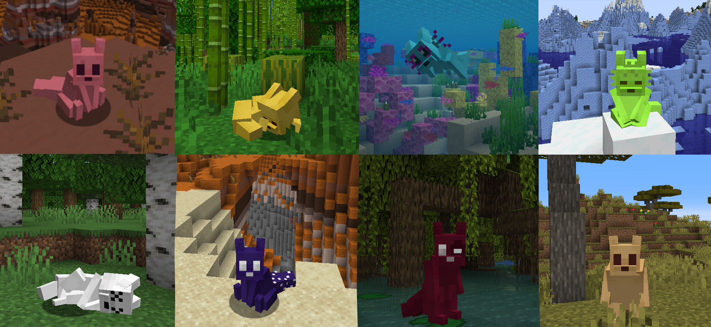

# Slugcat-MC-Skins
Slugcat MC Skins by Ohmanit These models require Customizable Player Models by tom54541

You may not publish these models under your name & distribute without giving proper credits.

NOTE: these models will only work in single player, you will need to apply a special plugin to your server to see other players models and be seen by others:
https://www.curseforge.com/minecraft/bukkit-plugins/custom-player-models-bukkit  

<b>
How to apply?
</b> 

1. Install Customizable Player Models from CurseForge/Modrinth/GitHub
2. Open your Minecraft directory/the folder of your profile 
3. Put the files in "player_models", if you can't find the folder simply create it yourself
4. Open a single player world and open the gestures menu (Keybind: G)
5. Go to Models and choose a model to play as

Enjoy!
